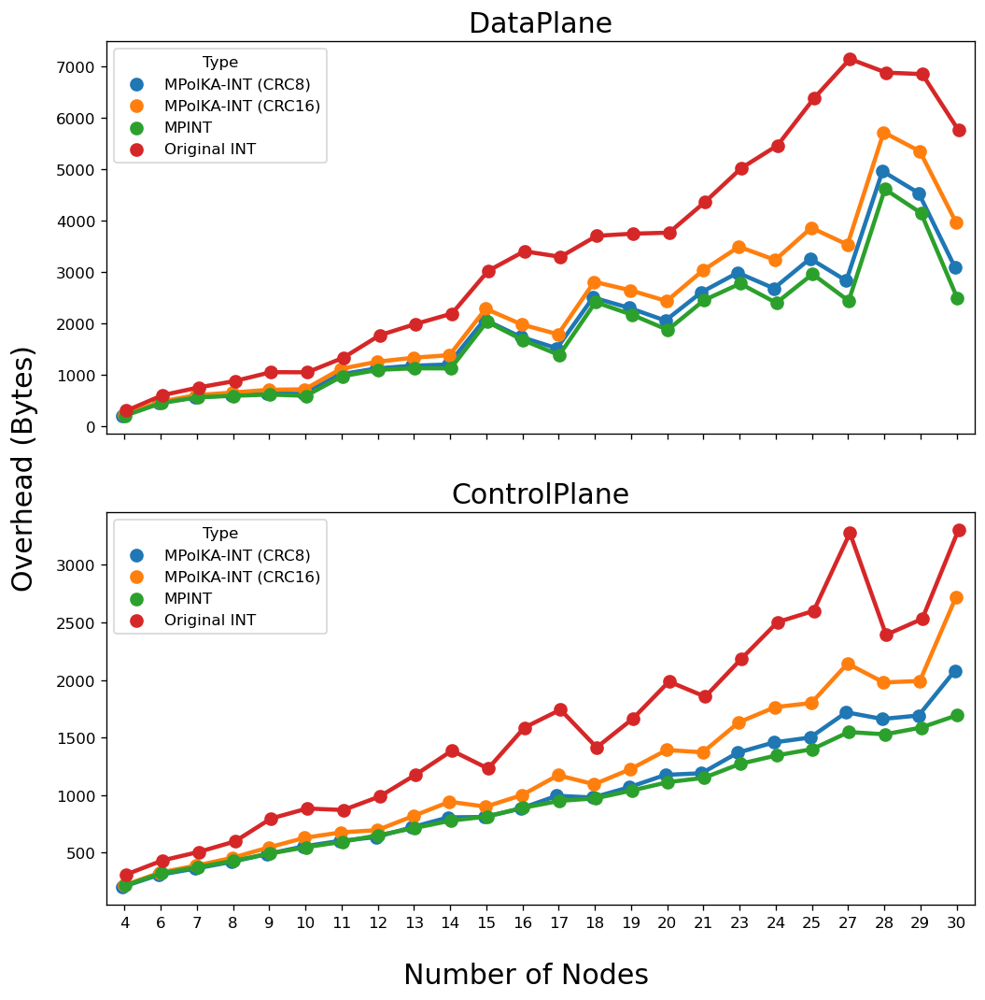
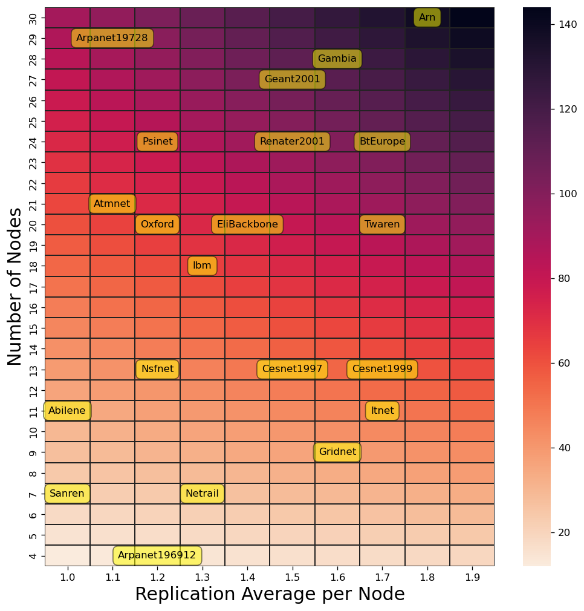
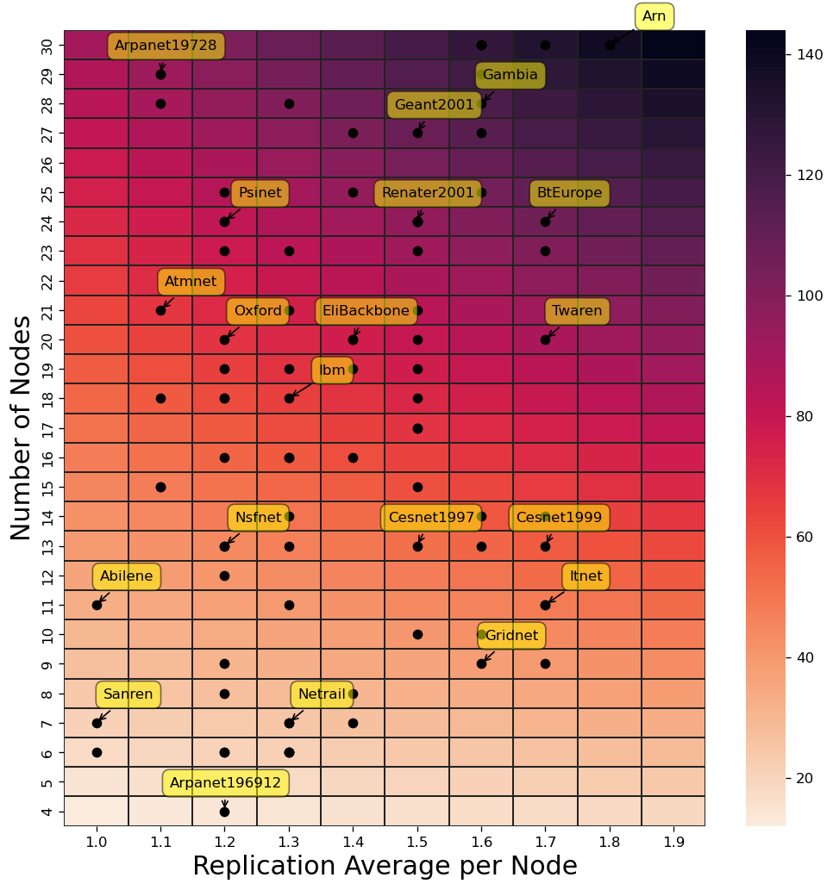

# MPolKA-INT: Stateless Multipath Source Routing for In-band Network Telemetry
_Isis de O. Pereira, Cristina K. Dominicini, Rafael S. Guimarães, Rodolfo S.Villaça, Lucas R. Almeida and Gilmar Vassoler_

# References
Topology Dataset - http://www.topology-zoo.org/dataset.html