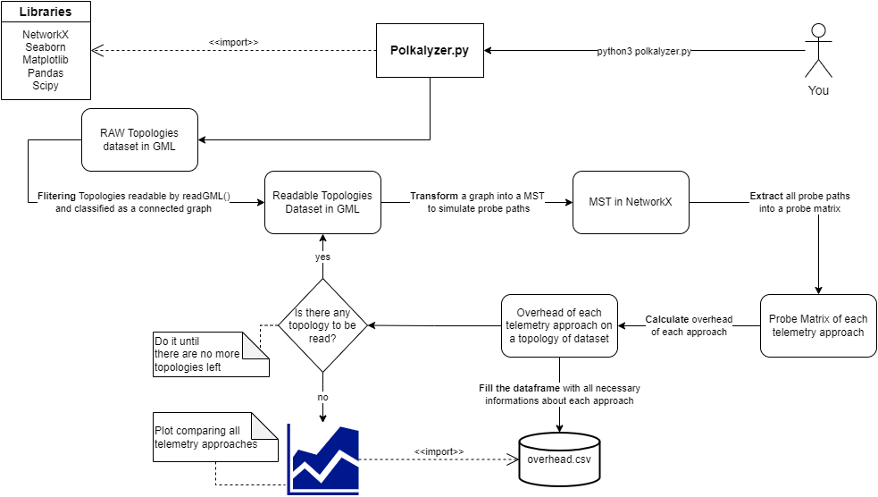

# Polkalyzer - Polka analyzer tool for any given topology.


# 

_This tool can be dissecated in multiple parts._ <br>
**Filter Raw Topologies Dataset:** <br>
1 - Load topologys dataset with NetworkX. <br>
2 - Remove topologys that can't be read by multiple factors. <br>
3 - Remove topologys that are disconnected graphs. <br>
**Transform a Graph into a MST:** <br>
4 - Transform GML Files that represent a topology into a **minimum spanning tree (MST)**. <br>
You can choose what MST Algorithm you want avaible in networkx.<br>
**Extract Probe Matrix:** <br>
5 - Perform a **DFS** in extracted MST to **simulate probes** from different telemetry approaches. <br>
You can choose the a fixed node sender or leave to algorithm decide the optimal node sender for all given topologies. <br>
**Fill the dataframe until there are no more unread topologies** <br>
6 - While algorithm is performing a DFS, the algorithm will extract a lot of usefull information about each topology and fill the dataframe. <br>
**Data Export:** <br>
7 - Export to **output/Topology** MPolKA-INT/MPINT probes to all topologys given in topologyZoo. <br> 
8 - Export to **output/Data** all usefull information collected into a csv. <br>
9 - Export to **output/Plots** different plots to help us to understand the information collected. <br>

## Installing Polkalyzer dependencies
You will need Python3 to run Polkalyzer, so try it:
```
python --version
```
If you haven't it, try install: https://www.python.org/downloads/ <br>

You also will need PIP dependencies:
```
pip install -r requirements.txt
```

## Using Polkalyzer
First of all, run Polkalyzer.py
```
python Polkalyzer.py
```
or
```
python3 Polkalyzer.py
```
 <br>
You can choose between three algorithm options, after chosen wait finish and check your output folder. <br>

## Troubleshooting
### If you can't run python or pip on CLI (Command Line Interface): <br>
**For Windows Users**: <br>
Check your Environment Variables to run **pip** on Terminal. <br>
```
- Enviroment Variables:
    Add to PATH:
    C:\Users\YOUR_USERNAME\AppData\Local\Programs\Python\Python3XY
    C:\Users\YOUR_USERNAME\AppData\Local\Programs\Python\Python3XY\Scripts
- New System Variable:
    Name: PYTHONUTF8
    Value: 1
```
Change **YOUR_USERNAME** to something like **lucas** <br>
Change **Python3XY** to something like **Python311** <br>

## Consider giving us a star :star:

If you have used or benefited from Polkalyzer in any way, we kindly ask you to show your support by giving us a star :star: on GitHub.
Your star is a valuable feedback for us, and it encourages us to continue improving the project. 

We are committed to delivering the best experience possible, and your feedback plays a crucial role in achieving this goal. So, if you enjoyed Polkalyzer, we would greatly appreciate your support through a star on our GitHub repository.

Thank you for your interest and contribution to our project. Your support means a lot to us!

## Contributing
You're free to contribute refactoring and improving our code. Don't hesite to fork this repo. <br>
How you can contribute: <br>
- [ ] Refactoring our code
- [ ] Improving performance comparing hash of output/
- [ ] Building more **utils** for the Control Plane
### Maintainers
- Lucas R. de Almeida      |    Email: contato@propi.dev        | @propilideno
- Rodolfo S. Villaca       |    Email: rodolfo.villaca@ufes.br  | @rodolfovillaca

## Log (Under Development)
- [x] Calculate the probe path from a topo
- [x] ~~Allowed to download topologys .gml from topologyZoo~~
- [x] Allowed to fill **input/** with topologys
- [x] Calculate overhead from MPINT Approach
- [x] Calculate overhead from MPolKA-INT Approach
- [x] Calculate overhead from Original INT Approach
- [x] Filling dataframe with topologys information
- [x] Allowing plotts
- [x] Allowing draws from (Graph and MST)
- [x] Allowed transform NetworkX Graphs into Mininet Topologys. 

# References
Topology Dataset - http://www.topology-zoo.org/dataset.html
